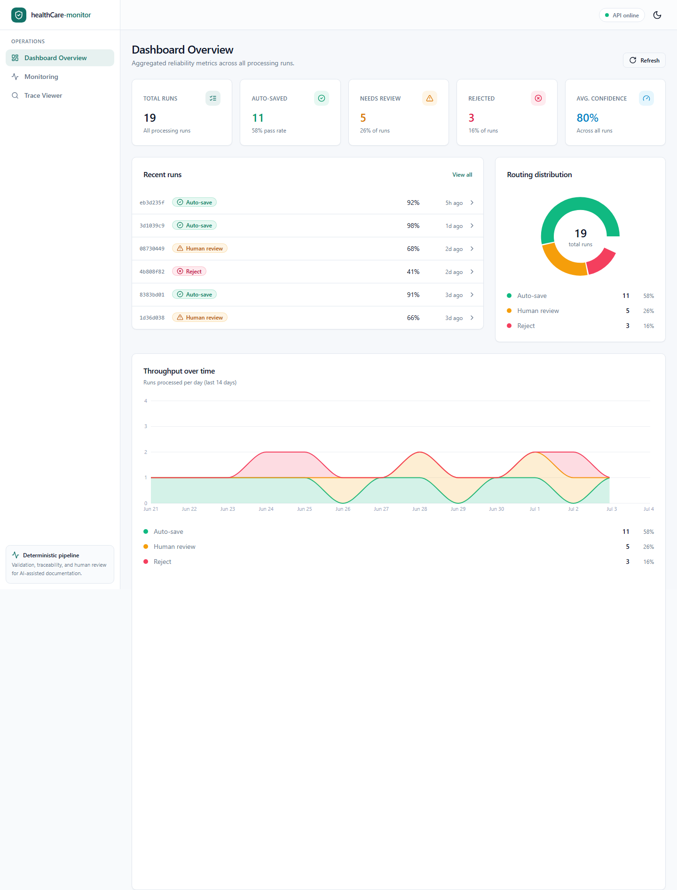

# healthCare-monitor (CareTrace)

**Reliable handling of AI-generated clinical documentation — structured extraction, deterministic validation, full traceability, and human review.**

[](caretrace/backend)
[](caretrace/frontend)
[](docs/TESTING.md)
[](docs/DEPLOYMENT.md)

CareTrace turns unstructured nursing/caregiver transcripts into structured clinical notes, then treats the model's output as **untrusted until proven otherwise**: every extraction passes deterministic schema and clinical-rule validation, receives a locally derived confidence score, and is either auto-saved or **flagged for human review**. Every run is stored as a complete, auditable trace.

> **Scope disclaimer** — this is a reliability-engineering MVP, not a certified medical device. It does **not** diagnose, prescribe, or recommend treatment. It performs structured documentation extraction and surfaces *potential inconsistencies* for human review.

---

## Live demo

| Surface | URL |
|---|---|
| Dashboard (frontend) | <https://health-care-monitor-steel.vercel.app> |
| API (backend) | <https://caretrace-backend.vercel.app/api/health> |



More captures: [`docs/screenshots/`](docs/screenshots/) · guided walkthrough: [`docs/DEMO_RUNBOOK.md`](docs/DEMO_RUNBOOK.md)

---

## Why this exists

Naive "call the model, store the JSON" pipelines fail exactly where healthcare cannot afford it: malformed output, missing fields, clinically implausible values, and no way to explain *why* a result was trusted. CareTrace demonstrates the engineering discipline that makes an LLM feature operationally credible:

- **Deterministic validation over model self-trust.** The model is never asked how confident it is. Confidence is derived locally from concrete validation outcomes and persisted as an auditable penalty breakdown that always sums to the final score.
- **Traceability by default.** Each run stores its transcript, raw model response, parsed output, validation issues, routing decision, confidence breakdown, and a step-by-step reasoning summary.
- **Human review as a first-class path** — including *edited approvals*, where a reviewer's correction is stored alongside (never over) the original extraction.
- **Advisory AI second read.** A deterministic reviewer assistant flags potential clinical risks for the operator; it never approves, rejects, or mutates a run.
- **Local-first observability.** Request-correlation IDs, structured JSON logs, and an in-app telemetry panel tie any UI action to the exact backend log line.

## Processing flow

```
transcript ──▶ extract structured note ──▶ schema validation ──▶ clinical rules
                                                │ (retry once on failure)
                                                ▼
                                     derived confidence score
                                                │
              ┌─────────────────────────────────┼──────────────────────┐
              ▼                                 ▼                      ▼
        auto-save (≥ 0.85,            human review queue         reject (< 0.50)
        no critical issues)         (0.50–0.85 or criticals)
```

Every path — including failures — persists a complete trace. Run statuses: `auto_saved`, `needs_review`, `reviewed`, `rejected`, `failed`.

## Repository layout

```
caretrace/
  backend/      FastAPI · Pydantic v2 · SQLAlchemy · Alembic · provider abstraction
  frontend/     Next.js 15 · TypeScript · Tailwind · shadcn/ui · TanStack Query
docs/           PRD, API reference, architecture, deployment & demo runbooks
prompts/        versioned extraction prompts
examples/       sample transcripts and outputs
```

## Quickstart (local demo)

No API key and no external database are required — the backend defaults to a local SQLite file, and the seeded dataset drives the entire dashboard.

**Backend** (Python 3.13, [uv](https://docs.astral.sh/uv/)):

```bash
cd caretrace/backend
cp .env.example .env                 # defaults are fine for a local demo
uv sync
uv run python -m app.seed_demo       # seed 19 demo runs
uv run uvicorn app.main:app --reload --port 8000
```

**Frontend** (Node 20+):

```bash
cd caretrace/frontend
cp .env.local.example .env.local     # points at http://localhost:8000/api
npm install
npm run dev                          # http://localhost:3000
```

To process live transcripts (optional), set `OPENAI_API_KEY` in the backend `.env`, or point `OLLAMA_BASE_URL` at a local Ollama instance.

**Production-like setup:** use Postgres (`DATABASE_URL=postgresql+psycopg://…`) with Alembic migrations (`uv run alembic upgrade head`). See [`docs/DEPLOYMENT.md`](docs/DEPLOYMENT.md) and [`docs/GO_LIVE_VERCEL.md`](docs/GO_LIVE_VERCEL.md).

## Testing

```bash
cd caretrace/backend  && uv run pytest        # 120 tests
cd caretrace/frontend && npm test -- --run    # 49 tests
```

Test priorities mirror the product's reliability goals: schema validation, clinical rules, retry behavior, confidence scoring, and routing decisions. Details in [`docs/TESTING.md`](docs/TESTING.md).

## API overview

Base path `/api` — stable, versionless contract documented in [`docs/API.md`](docs/API.md).

| Area | Endpoints |
|---|---|
| Health | `GET /health`, `GET /ready` |
| Processing | `POST /process` |
| Runs & traces | `GET /runs`, `GET /runs/{id}`, `GET /runs/{id}/trace` |
| Review queue | `GET /review`, `POST /review/{id}/approve` · `/edit` · `/reject` |
| Evaluation | `GET /evaluation` |

## Documentation

| Document | Contents |
|---|---|
| [`docs/PRODUCT_OVERVIEW.md`](docs/PRODUCT_OVERVIEW.md) | Executive summary and feature tour |
| [`ARCHITECTURE.md`](ARCHITECTURE.md) | System design and module boundaries |
| [`docs/PRD.md`](docs/PRD.md) | Product requirements and MVP scope |
| [`docs/API.md`](docs/API.md) | Full endpoint reference with schemas |
| [`docs/AI_PIPELINE.md`](docs/AI_PIPELINE.md) | Extraction, validation, scoring, and routing internals |
| [`DECISIONS.md`](DECISIONS.md) / [`docs/ENGINEERING_DECISIONS.md`](docs/ENGINEERING_DECISIONS.md) | Recorded trade-offs |
| [`docs/DEMO_RUNBOOK.md`](docs/DEMO_RUNBOOK.md) | Step-by-step live-demo script |
| [`SECURITY.md`](SECURITY.md) | Secrets policy, rotation runbook, PHI-safe logging |
| [`RELEASE_NOTES.md`](RELEASE_NOTES.md) | Current release: features, demo script, limitations |

## Product principles

1. Reliability over novelty
2. Deterministic validation over AI self-trust
3. Traceability over black-box behavior
4. Human review over unsafe automation
5. MVP discipline over feature sprawl
